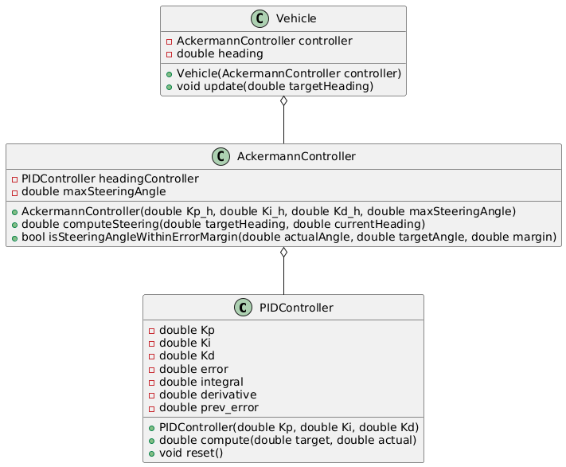
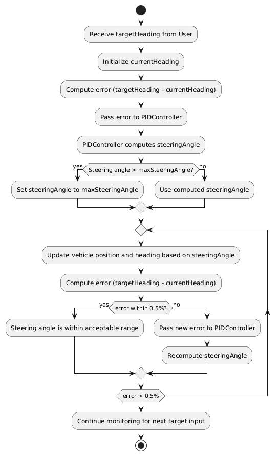

# Ackermann Sterring Controller for Autonomous Vehicles

# Project Badges


[](https://codecov.io/gh/DhairyaShah05/Midterm-Project-ENPM700)

[](LICENSE)

## Authors
Dhairya Shah
Harsh Senjaliya

## UML and Activity Diagrams for the Steering Controller Module 





## Standard install via command-line
```bash
# Download the code:
  git clone https://github.com/DhairyaShah05/Midterm-Project-ENPM700.git
  cd Midterm-Project-ENPM700
# Configure the project and generate a native build system:
  # Must re-run this command whenever any CMakeLists.txt file has been changed.
  cmake -S ./ -B build/
# Compile and build the project:
  # rebuild only files that are modified since the last build
  cmake --build build/
  # or rebuild everything from scracth
  cmake --build build/ --clean-first
  # to see verbose output, do:
  cmake --build build/ --verbose
# Run program:
  ./build/app/shell-app
# Run tests:
  cd build/; ctest; cd -
  # or if you have newer cmake
  ctest --test-dir build/
# Build docs:
  cmake --build build/ --target docs
  # open a web browser to browse the doc
  open docs/html/index.html
# Clean
  cmake --build build/ --target clean
# Clean and start over:
  rm -rf build/
```
# Build Commands for CodeCoverage 

```bash
# if you don't have gcovr or lcov installed, do:
  sudo apt-get install gcovr lcov
# Set the build type to Debug and WANT_COVERAGE=ON
  cmake -D WANT_COVERAGE=ON -D CMAKE_BUILD_TYPE=Debug -S ./ -B build/
# Now, do a clean compile, run unit test, and generate the covereage report
  cmake --build build/ --clean-first --target all test_coverage
# open a web browser to browse the test coverage report
  open build/test_coverage/index.html

This generates a index.html page in the build/test_coverage sub-directory that can be viewed locally in a web browser.
```
